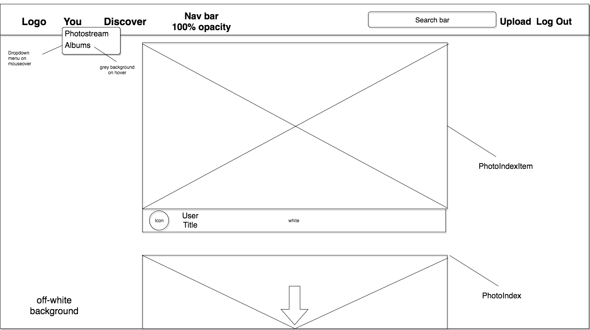

# Aperture

[Live site][heroku]

[heroku]: http://www.aperture-app.herokuapp.com

Aperture is a web application inspired by Flickr built using Ruby on Rails and React/Redux.

It utilizes the following technologies:
* Ruby on Rails backend
* PostgreSQL database
* React.js with a Redux architectural framework frontend


## Features & Implementation

### Note Rendering and Editing

  Photos are rendered in two different components: the `PhotoList` component, which shows photos and their respective heading in a scrollable list format, and the `PhotoIndex` component, displays photos in a justified gallery view. In both components, photos can be viewed using React Modals



### Single Page App

Flickr uses [React Router](https://github.com/ReactTraining/react-router) to keep all its content on a single root page.

```html
// root.jsx
<Provider store={ store }>
  <HashRouter>
    <App/>
  </HashRouter>
</Provider>

// App.jsx
<div>
  <header>
    <NavbarContainer />
  </header>
  <section>
    <Route exact path="/" component={ HomeContainer } />
    <ProtectedRoute exact path="/discover" component={ DiscoverContainer } />
    <ProtectedRoute exact path="/photos/:photoId" component={ PhotoDetailContainer } />
    <ProtectedRoute path="/users/:userId" component={ UserProfileContainer } />
    <ProtectedRoute exact path="/users/:userId" component={ UserPhotoContainer } />
    <ProtectedRoute exact path="/users/:userId/albums" component={ AlbumIndexContainer } />
    <ProtectedRoute exact path="/users/:userId/albums/:albumId" component={ AlbumShowContainer } />
  </section>
</div>
```
### Photos

Using [React Modals](https://github.com/reactjs/react-modal) to create a zoomed in view for users to get a close look at photos

```html
<Modal
  isOpen={this.state.modalOpen}
  onAfterOpen={this.afterModalOpen}
  onRequestClose={this.closeModal}
  style={PhotoModalStyle}
  contentLabel="PhotoModal"
  className="photo-modal"
  >
  <a onClick={this.closeModal}>Back to photos</a>
  <PhotoShowContainer key={photo.id} photo={photo} />
  <Link to={`/photos/${photo.id}`}>See photo detail</Link>
</Modal>
```


### Justified Gallery

Photos are displayed utilizing the [Justified Gallery](http://miromannino.github.io/Justified-Gallery/) JQuery plugin alongside React/Redux.

```js
componentDidUpdate() {
  $("#gallery").justifiedGallery({
    rowHeight : 300,
    lastRow : 'nojustify',
    margins : 9,
    cssAnimation: true,
  });
}
```

#### User Profile

User's profile provides a live view of their photostream and albums.


### Tags

Tags are stored in the database in a `tags` table and joined to a `photos` table through polymorphic associations.  The `tags` table contains the columns `id`, `name`, a `taggable_id` and `taggable_type`.  Through polymorphic associations, `Tags` can belong to more than one `photo` through a single association without the need for a joins table.

## Future Directions for the Project

The next steps in developing Aperture will be:

### Search

Allow users to search photos by their tags and display the results in realtime.

### Infinite Scroll

Implement infinite scroll to sequentially fetch photos as the user scrolls to the bottom of the page.
